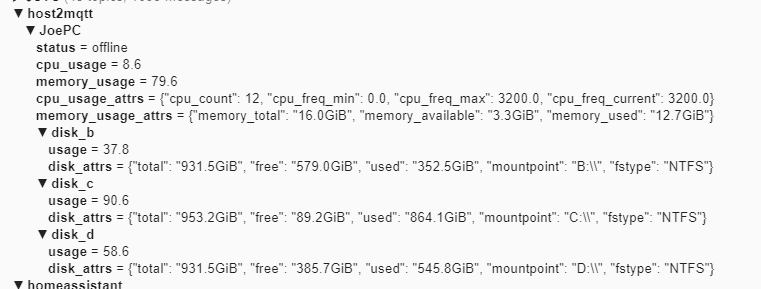

# host2mqtt - Deliver system status information over MQTT.

This program uses `psutil` to monitor your systems performance stats and report them to an MQTT server. 

It can also publish Home Assistant MQTT Discovery messages so that binary sensors automatically show up in Home Assistant.

# Running

Run this container using docker compose:
```yaml
version: '3'
services:
  host2mqtt:
    container_name: docker2mqtt
    image: denizenn/host2mqtt
    environment:
    - HOST2MQTT_HOSTNAME=my_host
    - HOMEASSISTANT_PREFIX=homeassistant
    - MQTT_CLIENT_ID=host2mqtt
    - MQTT_HOST=mosquitto
    - MQTT_PORT=1883
    - MQTT_USER=username
    - MQTT_PASSWD=password
    - MQTT_TIMEOUT=30
    - MQTT_TOPIC_PREFIX=host2mqtt
    - MQTT_QOS=1
    - STATS_DELAY=5
    restart: always
```

# Configuration

You can use environment variables to control the behavior.

| Variable               | Default         | Description                                                                                                           |
|------------------------|-----------------|-----------------------------------------------------------------------------------------------------------------------|
| `DEBUG`                |                 | Set to `1` to enable additional debug logging.                                                                        |
| `HOST2MQTT_HOSTNAME`   | Hostname        | The hostname of your system. This is used as a topic in MQTT.                                                         |
| `HOMEASSISTANT_PREFIX` | `homeassistant` | The prefix for Home Assistant discovery. Must be the same as `discovery_prefix` in your Home Assistant configuration. |
| `MQTT_CLIENT_ID`       | `host2mqtt`     | The client id to send to the MQTT broker.                                                                             |
| `MQTT_HOST`            | `localhost`     | The MQTT broker to connect to.                                                                                        |
| `MQTT_PORT`            | `1883`          | The port on the broker to connect to.                                                                                 |
| `MQTT_USER`            | ``              | The user to send to the MQTT broker. Leave unset to disable authentication.                                           |
| `MQTT_PASSWD`          | ``              | The password to send to the MQTT broker. Leave unset to disable authentication.                                       |
| `MQTT_TIMEOUT`         | `30`            | The timeout for the MQTT connection.                                                                                  |
| `MQTT_TOPIC_PREFIX`    | `host2mqtt`     | The MQTT topic prefix. With the default data will be published to `ping/<hostname>`.                                  |
| `MQTT_QOS`             | `1`             | The MQTT QOS level                                                                                                    |
| `STATS_DELAY`          | `5`             | Seconds between the psutil stats being reported via MQTT.                                                             |
 

# Published Data

The container publishes the following data

CPU: 
- Usage (as a percentage)
- Count
- Minimum Frequency
- Maximum Frequency
- Current Frequency

Memory:
- Usage (as a percentage)
- Total memory (human-readable format)
- Available memory (human-readable format)
- Used memory (human-readable format)

Storage (for each mounted disk, you see the following):
- Usage (as a percentage)
- Total space (human-readable format)
- Free space (human-readable format)
- Used space (human-readable format)
- Mount point
- Filesystem type (e.g NTFS, EXT4 etc..)

# Consuming The Data

Data is published to various topics of the style `{MQTT_TOPIC_PREFIX}/{HOSTNAME}/<stat>`. Here is an example of the data created per container.



# Home Assistant

After you start the service, devices should show up in Home Assistant immediately.
All the metadata, stats and controls for each container are entities in the device.


